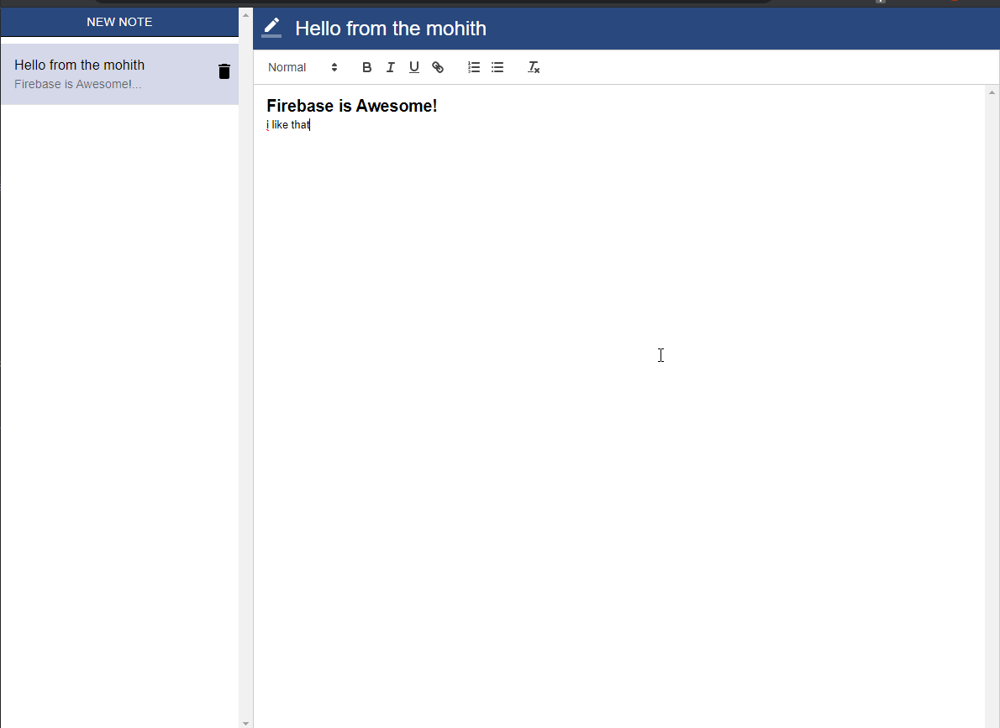

# React Notes App 
___

# Screenshot


# To Clone Repo :
```bash 
$ git clone [Repo URL]
```

# To install Packages
```bash
$ npm install
```

# Run Code :
```bash
$ npm start
```

## ___STATUS___
___
# Next Project - Coming Soon 👨🏼‍💻